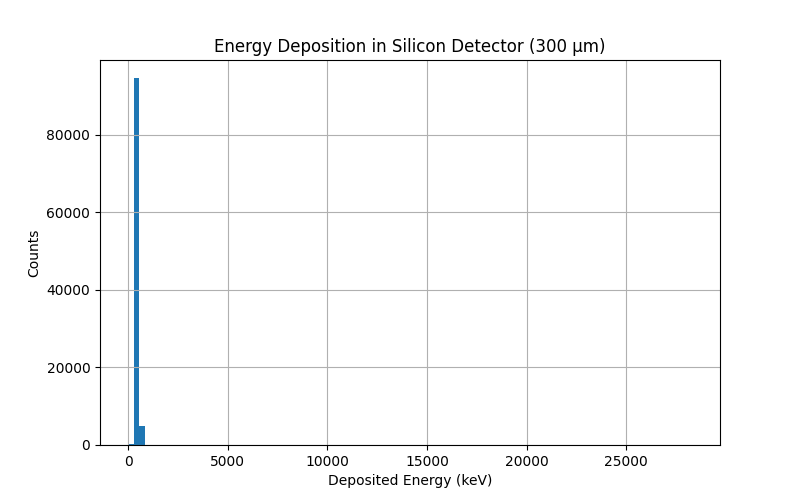

# Geant4 LEO Proton Detector Simulation

Monte Carlo simulation of proton energy deposition and Linear Energy Transfer (LET) in silicon detectors using Geant4, with applications to space radiation environments.

---

## Overview

This project models the interaction of energetic protons with a semiconductor detector, representative of electronic systems operating in Low Earth Orbit (LEO).

The simulation focuses on energy deposition and radiation effects in silicon, including the impact of aluminum shielding typically found in spacecraft structures.

---

## Physical Model

The simulation includes:

- Proton source (10–200 MeV)
- Silicon detector (300 µm thickness)
- Vacuum environment (G4_Galactic)
- Aluminum shielding layer (configurable)

Geant4 handles particle transport and physics processes, including:

- Ionization energy loss (Bethe–Bloch regime)
- Multiple scattering
- Energy deposition fluctuations (Landau-like behavior)

---

## Key Concepts

### Energy Deposition

The detector operates in a **thin-target regime**, where protons traverse the silicon without stopping.

This results in:

- Partial energy deposition (keV range)
- Narrow statistical distributions
- Event-by-event fluctuations

---

### Linear Energy Transfer (LET)

The simulation computes:

LET = dE/dx

Where:

- dE = energy deposited in silicon
- dx = detector thickness (300 µm)

LET is a critical parameter for evaluating radiation effects in microelectronics, including:

- Single Event Upsets (SEU)
- Device degradation
- Radiation hardness

---

### Shielding Effects

An aluminum layer is introduced to simulate spacecraft shielding.

Observed effects include:

- Reduction of particle energy before reaching the detector
- Decrease in deposited energy
- Modification of the energy distribution
- Attenuation of radiation-induced effects

---

## Example Result

Energy deposition in a 300 µm silicon detector:

- Typical deposited energy: **~50–200 keV**
- Narrow peak due to thin detector geometry
- Reduced energy deposition when shielding is applied

---

## Output

The simulation generates a CSV file:
